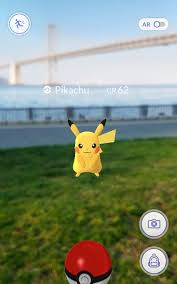
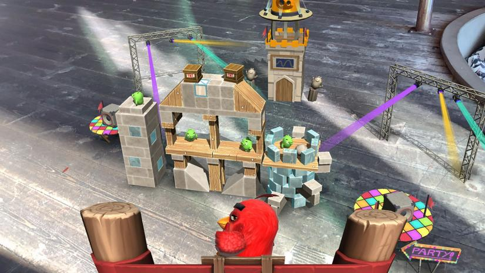
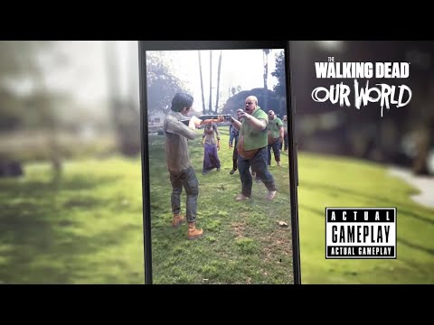
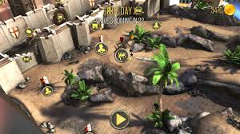

# AR-Project-SPbSTU-2021
## HEAD
### Team members: 
   #### Ilia Doinikov — **techlead**
   #### Alexander Kolodinsky
   #### Yampil Darizhapov — **teamlead**
   #### Ivan Troshchenkov
## BODY
AR Project - interactive quest on SPBSTU campus territory. Quest will include mini-games that based on unique AR mechanics which are often not used in popular AR games.
Many popular AR games do not use AR game mechanics as such. 
For example, Pokemon GO: 
, which simply places the Pokemon on the view of your cam, and its main mechanics are more geolocation-dependent than AR-dependent. 
The rest of the AR games are port of regular mobile AR games. Oftentimes, these games don't use AR mechanics, but simply port the game's playing field to AR. Examples:
Angry Birds AR: Isle of Pigs: 


(angry birds in AR) 

The Walking Dead: Our World 


(shooter in AR)

Knightfall AR 


(tower defense in AR)

## Commit requirements:
1.  Language: English
2.  Bare infinitive (add, fix, load)
4.  Header line must begin with issue number(#101)
5.  Brief changes description — in header
6.  What changes have been made — in description
7.  Enumeration in description starts from "-" with space after that. One line — one change.
### Commit example:
#### Header
``` c#
#322 Add textures
```
#### Description
```c++
- add wall texture
- add ground texture
```
## Code style:
  ### Camel case:
       int camelCase;
       class CamelCase...
  ### Comments: 
    Letterhead of file: 
     /*
      * FILE: "###.###"
      * File description(vector declaratioт file e.g.)
      * Members: Vasya Pupkin, Sasha Trubkin
      * Date: 12.12.2012
      */
   #### Classes:
       /*Vector handle class*/
   #### Functions: 
    /* Sum of two vector function
     * ARGUMENTS:
     * - vectors to Add
     *     Vec a, Vec b
     * RETURNS: (Vec) sum of 2 vectors
     */
      Vec Sum(Vec a, Vec b);
   #### Objects in classes:
      // Components
      double x, y, z
   #### Comments are also welcomed before each semantic block of the program:
      // Sort components
      for...
      ...
      

  
 
